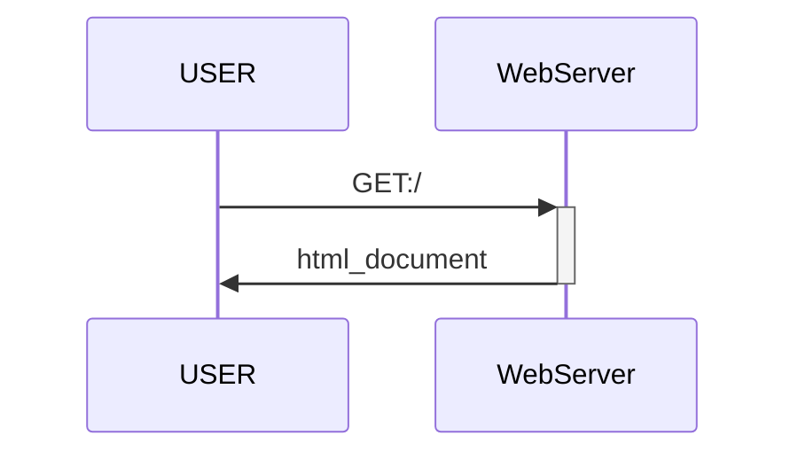
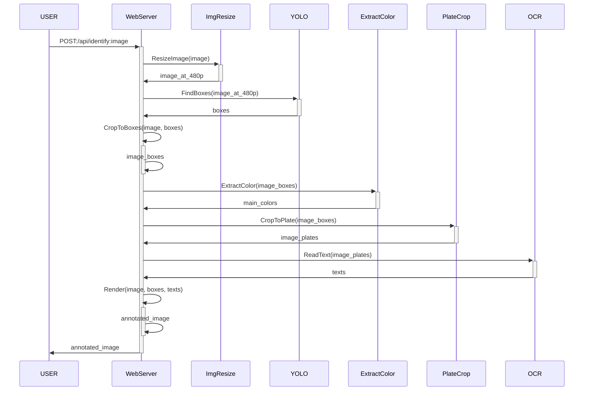
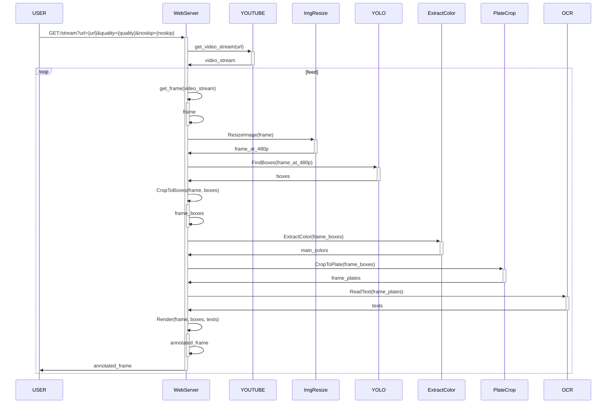

# Vehicle-Identification

This is a demo of how complex A.I. appication can be deployed as microservices on cloud environment. This project can be used as heavy and non-consistant load for load-balancing testbeds.

## Architecture

![Architecture](data:image/svg+xml;base64,PHN2ZyB3aWR0aD0iMTI4MCIgaGVpZ2h0PSI3MjAiIHhtbG5zPSJodHRwOi8vd3d3LnczLm9yZy8yMDAwL3N2ZyIgeG1sbnM6eGxpbms9Imh0dHA6Ly93d3cudzMub3JnLzE5OTkveGxpbmsiIG92ZXJmbG93PSJoaWRkZW4iPjxnPjxyZWN0IHg9IjAiIHk9IjAiIHdpZHRoPSIxMjgwIiBoZWlnaHQ9IjcyMCIgZmlsbD0ibm9uZSIvPjxyZWN0IHg9IjQ4MCIgeT0iMzcyIiB3aWR0aD0iNDQwIiBoZWlnaHQ9IjgxIiBzdHJva2U9IiMwNTI5MDkiIHN0cm9rZS13aWR0aD0iMiIgc3Ryb2tlLW1pdGVybGltaXQ9IjgiIGZpbGw9IiMxOTZCMjQiLz48dGV4dCBmaWxsPSIjRkZGRkZGIiBmb250LWZhbWlseT0iQXB0b3MsQXB0b3NfTVNGb250U2VydmljZSxzYW5zLXNlcmlmIiBmb250LXdlaWdodD0iNDAwIiBmb250LXNpemU9IjI0IiB0cmFuc2Zvcm09InRyYW5zbGF0ZSg2NDMuNjIxIDQyMCkiPldlYlNlcnZlcjwvdGV4dD48cmVjdCB4PSIxMjgiIHk9IjE0MiIgd2lkdGg9IjE2NyIgaGVpZ2h0PSI4MSIgc3Ryb2tlPSIjMDQyNDMzIiBzdHJva2Utd2lkdGg9IjIiIHN0cm9rZS1taXRlcmxpbWl0PSI4IiBmaWxsPSIjMTU2MDgyIi8+PHRleHQgZmlsbD0iI0ZGRkZGRiIgZm9udC1mYW1pbHk9IkFwdG9zLEFwdG9zX01TRm9udFNlcnZpY2Usc2Fucy1zZXJpZiIgZm9udC13ZWlnaHQ9IjQwMCIgZm9udC1zaXplPSIyNCIgdHJhbnNmb3JtPSJ0cmFuc2xhdGUoMTQ2LjE2IDE5MCkiPlJlc2l6ZUltYWdlPC90ZXh0PjxyZWN0IHg9IjY2NCIgeT0iMTQxIiB3aWR0aD0iMTY3IiBoZWlnaHQ9IjgxIiBzdHJva2U9IiM2MjJDMEYiIHN0cm9rZS13aWR0aD0iMiIgc3Ryb2tlLW1pdGVybGltaXQ9IjgiIGZpbGw9IiNFOTcxMzIiLz48dGV4dCBmaWxsPSIjRkZGRkZGIiBmb250LWZhbWlseT0iQXB0b3MsQXB0b3NfTVNGb250U2VydmljZSxzYW5zLXNlcmlmIiBmb250LXdlaWdodD0iNDAwIiBmb250LXNpemU9IjI0IiB0cmFuc2Zvcm09InRyYW5zbGF0ZSg3MDYuMiAxODkpIj5ZT0xPdjg8L3RleHQ+PHJlY3QgeD0iMzA3IiB5PSIxNDIiIHdpZHRoPSIxNjciIGhlaWdodD0iODEiIHN0cm9rZT0iIzA0MjQzMyIgc3Ryb2tlLXdpZHRoPSIyIiBzdHJva2UtbWl0ZXJsaW1pdD0iOCIgZmlsbD0iIzE1NjA4MiIvPjx0ZXh0IGZpbGw9IiNGRkZGRkYiIGZvbnQtZmFtaWx5PSJBcHRvcyxBcHRvc19NU0ZvbnRTZXJ2aWNlLHNhbnMtc2VyaWYiIGZvbnQtd2VpZ2h0PSI0MDAiIGZvbnQtc2l6ZT0iMjQiIHRyYW5zZm9ybT0idHJhbnNsYXRlKDMyNS42ODUgMTkwKSI+RXh0cmFjdENvbG9yPC90ZXh0PjxyZWN0IHg9Ijg0MiIgeT0iMTQyIiB3aWR0aD0iMTY3IiBoZWlnaHQ9IjgxIiBzdHJva2U9IiM2MjJDMEYiIHN0cm9rZS13aWR0aD0iMiIgc3Ryb2tlLW1pdGVybGltaXQ9IjgiIGZpbGw9IiNFOTcxMzIiLz48dGV4dCBmaWxsPSIjRkZGRkZGIiBmb250LWZhbWlseT0iQXB0b3MsQXB0b3NfTVNGb250U2VydmljZSxzYW5zLXNlcmlmIiBmb250LXdlaWdodD0iNDAwIiBmb250LXNpemU9IjI0IiB0cmFuc2Zvcm09InRyYW5zbGF0ZSg4NzMuNzc5IDE5MCkiPlBsYXRlQ3JvcDwvdGV4dD48cmVjdCB4PSIxMDIxIiB5PSIxNDIiIHdpZHRoPSIxNjciIGhlaWdodD0iODEiIHN0cm9rZT0iIzYyMkMwRiIgc3Ryb2tlLXdpZHRoPSIyIiBzdHJva2UtbWl0ZXJsaW1pdD0iOCIgZmlsbD0iI0U5NzEzMiIvPjx0ZXh0IGZpbGw9IiNGRkZGRkYiIGZvbnQtZmFtaWx5PSJBcHRvcyxBcHRvc19NU0ZvbnRTZXJ2aWNlLHNhbnMtc2VyaWYiIGZvbnQtd2VpZ2h0PSI0MDAiIGZvbnQtc2l6ZT0iMjQiIHRyYW5zZm9ybT0idHJhbnNsYXRlKDEwNzkuOTggMTkwKSI+T0NSPC90ZXh0PjxwYXRoIGQ9Ik0xMDYuNSAyOTMuNSAxMjEyLjg4IDI5My41IiBzdHJva2U9IiMxNTYwODIiIHN0cm9rZS13aWR0aD0iMS4zMzMzMyIgc3Ryb2tlLW1pdGVybGltaXQ9IjgiIGZpbGw9Im5vbmUiIGZpbGwtcnVsZT0iZXZlbm9kZCIvPjx0ZXh0IGZvbnQtZmFtaWx5PSJBcHRvcyxBcHRvc19NU0ZvbnRTZXJ2aWNlLHNhbnMtc2VyaWYiIGZvbnQtd2VpZ2h0PSI0MDAiIGZvbnQtc2l6ZT0iMjQiIHRyYW5zZm9ybT0idHJhbnNsYXRlKDI4LjYxIDMwMCkiPmdSUEM8L3RleHQ+PHBhdGggZD0iTTAgMCAwLjYzMzgwNiA2OS4zMDciIHN0cm9rZT0iIzE1NjA4MiIgc3Ryb2tlLXdpZHRoPSIxLjMzMzMzIiBzdHJva2UtbWl0ZXJsaW1pdD0iOCIgZmlsbD0ibm9uZSIgZmlsbC1ydWxlPSJldmVub2RkIiB0cmFuc2Zvcm09Im1hdHJpeCgtMSAwIDAgMSAyMTIuMTM0IDIyMy41KSIvPjxwYXRoIGQ9Ik0wIDAgMC42MzM4MDYgNjkuMzA3IiBzdHJva2U9IiMxNTYwODIiIHN0cm9rZS13aWR0aD0iMS4zMzMzMyIgc3Ryb2tlLW1pdGVybGltaXQ9IjgiIGZpbGw9Im5vbmUiIGZpbGwtcnVsZT0iZXZlbm9kZCIgdHJhbnNmb3JtPSJtYXRyaXgoLTEgMCAwIDEgNzQ3LjEzNCAyMjIuNSkiLz48cGF0aCBkPSJNMCAwIDAuNjMzODA2IDY5LjMwNyIgc3Ryb2tlPSIjMTU2MDgyIiBzdHJva2Utd2lkdGg9IjEuMzMzMzMiIHN0cm9rZS1taXRlcmxpbWl0PSI4IiBmaWxsPSJub25lIiBmaWxsLXJ1bGU9ImV2ZW5vZGQiIHRyYW5zZm9ybT0ibWF0cml4KC0xIDAgMCAxIDM5Mi4xMzQgMjIzLjUpIi8+PHBhdGggZD0iTTAgMCAwLjYzMzgwNiA2OS4zMDciIHN0cm9rZT0iIzE1NjA4MiIgc3Ryb2tlLXdpZHRoPSIxLjMzMzMzIiBzdHJva2UtbWl0ZXJsaW1pdD0iOCIgZmlsbD0ibm9uZSIgZmlsbC1ydWxlPSJldmVub2RkIiB0cmFuc2Zvcm09Im1hdHJpeCgtMSAwIDAgMSA5MjkuMTM0IDIyMy41KSIvPjxwYXRoIGQ9Ik0wIDAgMC42MzM4MDYgNjkuMzA3IiBzdHJva2U9IiMxNTYwODIiIHN0cm9rZS13aWR0aD0iMS4zMzMzMyIgc3Ryb2tlLW1pdGVybGltaXQ9IjgiIGZpbGw9Im5vbmUiIGZpbGwtcnVsZT0iZXZlbm9kZCIgdHJhbnNmb3JtPSJtYXRyaXgoLTEgMCAwIDEgMTEwNS4xMyAyMjMuNSkiLz48cGF0aCBkPSJNMCAwIDAuNjMzODA2IDgwLjA2NTMiIHN0cm9rZT0iIzE1NjA4MiIgc3Ryb2tlLXdpZHRoPSIxLjMzMzMzIiBzdHJva2UtbWl0ZXJsaW1pdD0iOCIgZmlsbD0ibm9uZSIgZmlsbC1ydWxlPSJldmVub2RkIiB0cmFuc2Zvcm09Im1hdHJpeCgtMSAwIDAgMSA3ODcuMTM0IDI5My41KSIvPjxwYXRoIGQ9Ik05MzEuNSA0MTQuNSAxMTA1LjQ0IDQxNC41IiBzdHJva2U9IiMxNTYwODIiIHN0cm9rZS13aWR0aD0iMS4zMzMzMyIgc3Ryb2tlLW1pdGVybGltaXQ9IjgiIGZpbGw9Im5vbmUiIGZpbGwtcnVsZT0iZXZlbm9kZCIvPjxyZWN0IHg9IjY5OS41IiB5PSI1NjUuNSIgd2lkdGg9IjE4NSIgaGVpZ2h0PSIzOSIgc3Ryb2tlPSIjMDAwMDAwIiBzdHJva2UtbGluZWpvaW49InJvdW5kIiBzdHJva2UtbWl0ZXJsaW1pdD0iMTAiIGZpbGw9IiNGRkZGRkYiLz48dGV4dCBmb250LWZhbWlseT0iQXB0b3MsQXB0b3NfTVNGb250U2VydmljZSxzYW5zLXNlcmlmIiBmb250LXdlaWdodD0iNDAwIiBmb250LXNpemU9IjI0IiB0cmFuc2Zvcm09InRyYW5zbGF0ZSg3MDkuNjkzIDU5MikiPkJyb3dzZXIvPC90ZXh0Pjx0ZXh0IGZvbnQtZmFtaWx5PSJBcHRvcyxBcHRvc19NU0ZvbnRTZXJ2aWNlLHNhbnMtc2VyaWYiIGZvbnQtd2VpZ2h0PSI0MDAiIGZvbnQtc2l6ZT0iMjQiIHRyYW5zZm9ybT0idHJhbnNsYXRlKDgwMi40OTMgNTkyKSI+TG88L3RleHQ+PHRleHQgZm9udC1mYW1pbHk9IkFwdG9zLEFwdG9zX01TRm9udFNlcnZpY2Usc2Fucy1zZXJpZiIgZm9udC13ZWlnaHQ9IjQwMCIgZm9udC1zaXplPSIyNCIgdHJhbnNmb3JtPSJ0cmFuc2xhdGUoODI3LjcyIDU5MikiPmM8L3RleHQ+PHRleHQgZm9udC1mYW1pbHk9IkFwdG9zLEFwdG9zX01TRm9udFNlcnZpY2Usc2Fucy1zZXJpZiIgZm9udC13ZWlnaHQ9IjQwMCIgZm9udC1zaXplPSIyNCIgdHJhbnNmb3JtPSJ0cmFuc2xhdGUoODQwLjM4NyA1OTIpIj51c3Q8L3RleHQ+PHBhdGggZD0iTTc4Ni41IDQ1My41IDc4Ni41IDU2NS41MTgiIHN0cm9rZT0iIzE1NjA4MiIgc3Ryb2tlLXdpZHRoPSIxLjMzMzMzIiBzdHJva2UtbWl0ZXJsaW1pdD0iOCIgZmlsbD0ibm9uZSIgZmlsbC1ydWxlPSJldmVub2RkIi8+PHBhdGggZD0iTTAgMCAwLjYzMzgwNiA4MC4wNjUzIiBzdHJva2U9IiMxNTYwODIiIHN0cm9rZS13aWR0aD0iMS4zMzMzMyIgc3Ryb2tlLW1pdGVybGltaXQ9IjgiIGZpbGw9Im5vbmUiIGZpbGwtcnVsZT0iZXZlbm9kZCIgdHJhbnNmb3JtPSJtYXRyaXgoLTEgMCAwIDEgMjQ1LjEzNCAyOTIuNSkiLz48cmVjdCB4PSIxNDUiIHk9IjM3MCIgd2lkdGg9IjE5NyIgaGVpZ2h0PSI4MSIgc3Ryb2tlPSIjMUM0NDBEIiBzdHJva2Utd2lkdGg9IjIiIHN0cm9rZS1taXRlcmxpbWl0PSI4IiBmaWxsPSIjNEVBNzJFIi8+PHRleHQgZmlsbD0iI0ZGRkZGRiIgZm9udC1mYW1pbHk9IkFwdG9zLEFwdG9zX01TRm9udFNlcnZpY2Usc2Fucy1zZXJpZiIgZm9udC13ZWlnaHQ9IjQwMCIgZm9udC1zaXplPSIyNCIgdHJhbnNmb3JtPSJ0cmFuc2xhdGUoMjA1LjE2MyA0MTgpIj5JZGVudGlmeTwvdGV4dD48cmVjdCB4PSI5ODMuNSIgeT0iMzczLjUiIHdpZHRoPSI3MC45OTk5IiBoZWlnaHQ9IjM5IiBzdHJva2U9IiMwMDAwMDAiIHN0cm9rZS1saW5lam9pbj0icm91bmQiIHN0cm9rZS1taXRlcmxpbWl0PSIxMCIgZmlsbD0iI0ZGRkZGRiIvPjx0ZXh0IGZvbnQtZmFtaWx5PSJBcHRvcyxBcHRvc19NU0ZvbnRTZXJ2aWNlLHNhbnMtc2VyaWYiIGZvbnQtd2VpZ2h0PSI0MDAiIGZvbnQtc2l6ZT0iMjQiIHRyYW5zZm9ybT0idHJhbnNsYXRlKDk5Mi42MTYgNDAwKSI+SFRUUDwvdGV4dD48cGF0aCBkPSJNMCAwIDAuNjMzODA2IDgwLjA2NTMiIHN0cm9rZT0iIzE1NjA4MiIgc3Ryb2tlLXdpZHRoPSIxLjMzMzMzIiBzdHJva2UtbWl0ZXJsaW1pdD0iOCIgZmlsbD0ibm9uZSIgZmlsbC1ydWxlPSJldmVub2RkIiB0cmFuc2Zvcm09Im1hdHJpeCgtMSAwIDAgMSA2MDYuMTM0IDI5My41KSIvPjxyZWN0IHg9IjUwOC41IiB5PSI1NjUuNSIgd2lkdGg9IjE5MSIgaGVpZ2h0PSIzOSIgc3Ryb2tlPSIjMDAwMDAwIiBzdHJva2UtbGluZWpvaW49InJvdW5kIiBzdHJva2UtbWl0ZXJsaW1pdD0iMTAiIGZpbGw9IiNGRkZGRkYiLz48dGV4dCBmb250LWZhbWlseT0iQXB0b3MsQXB0b3NfTVNGb250U2VydmljZSxzYW5zLXNlcmlmIiBmb250LXdlaWdodD0iNDAwIiBmb250LXNpemU9IjI0IiB0cmFuc2Zvcm09InRyYW5zbGF0ZSg1MTkuMDA2IDU5MikiPko8L3RleHQ+PHRleHQgZm9udC1mYW1pbHk9IkFwdG9zLEFwdG9zX01TRm9udFNlcnZpY2Usc2Fucy1zZXJpZiIgZm9udC13ZWlnaHQ9IjQwMCIgZm9udC1zaXplPSIyNCIgdHJhbnNmb3JtPSJ0cmFuc2xhdGUoNTI3LjAwNiA1OTIpIj5tPC90ZXh0Pjx0ZXh0IGZvbnQtZmFtaWx5PSJBcHRvcyxBcHRvc19NU0ZvbnRTZXJ2aWNlLHNhbnMtc2VyaWYiIGZvbnQtd2VpZ2h0PSI0MDAiIGZvbnQtc2l6ZT0iMjQiIHRyYW5zZm9ybT0idHJhbnNsYXRlKDU0Ny41MDYgNTkyKSI+ZXRlcjwvdGV4dD48dGV4dCBmb250LWZhbWlseT0iQXB0b3MsQXB0b3NfTVNGb250U2VydmljZSxzYW5zLXNlcmlmIiBmb250LXdlaWdodD0iNDAwIiBmb250LXNpemU9IjI0IiB0cmFuc2Zvcm09InRyYW5zbGF0ZSg1ODguNTUzIDU5MikiPi9Qb3N0bWFuPC90ZXh0PjxwYXRoIGQ9Ik02MDQuNSA0NTMuNSA2MDQuNSA1NjUuNTE4IiBzdHJva2U9IiMxNTYwODIiIHN0cm9rZS13aWR0aD0iMS4zMzMzMyIgc3Ryb2tlLW1pdGVybGltaXQ9IjgiIGZpbGw9Im5vbmUiIGZpbGwtcnVsZT0iZXZlbm9kZCIvPjxyZWN0IHg9Ijc4OC41IiB5PSI0OTAuNSIgd2lkdGg9IjcwIiBoZWlnaHQ9IjM5IiBzdHJva2U9IiMwMDAwMDAiIHN0cm9rZS1saW5lam9pbj0icm91bmQiIHN0cm9rZS1taXRlcmxpbWl0PSIxMCIgZmlsbD0iI0ZGRkZGRiIvPjx0ZXh0IGZvbnQtZmFtaWx5PSJBcHRvcyxBcHRvc19NU0ZvbnRTZXJ2aWNlLHNhbnMtc2VyaWYiIGZvbnQtd2VpZ2h0PSI0MDAiIGZvbnQtc2l6ZT0iMjQiIHRyYW5zZm9ybT0idHJhbnNsYXRlKDc5Ny4xMjcgNTE3KSI+SFRUUDwvdGV4dD48cmVjdCB4PSI2MDUuNSIgeT0iNDkwLjUiIHdpZHRoPSI3MSIgaGVpZ2h0PSIzOSIgc3Ryb2tlPSIjMDAwMDAwIiBzdHJva2UtbGluZWpvaW49InJvdW5kIiBzdHJva2UtbWl0ZXJsaW1pdD0iMTAiIGZpbGw9IiNGRkZGRkYiLz48dGV4dCBmb250LWZhbWlseT0iQXB0b3MsQXB0b3NfTVNGb250U2VydmljZSxzYW5zLXNlcmlmIiBmb250LXdlaWdodD0iNDAwIiBmb250LXNpemU9IjI0IiB0cmFuc2Zvcm09InRyYW5zbGF0ZSg2MTQuNzY1IDUxNykiPkhUVFA8L3RleHQ+PHBhdGggZD0iTTExMTcgMzkwLjY2N0MxMTE3IDM4NC4yMjMgMTEyMi4yMiAzNzkgMTEyOC42NyAzNzlMMTIzMy4zMyAzNzlDMTIzOS43OCAzNzkgMTI0NSAzODQuMjIzIDEyNDUgMzkwLjY2N0wxMjQ1IDQzNy4zMzNDMTI0NSA0NDMuNzc3IDEyMzkuNzggNDQ5IDEyMzMuMzMgNDQ5TDExMjguNjcgNDQ5QzExMjIuMjIgNDQ5IDExMTcgNDQzLjc3NyAxMTE3IDQzNy4zMzNaIiBzdHJva2U9IiNGRkZGRkYiIHN0cm9rZS13aWR0aD0iMiIgc3Ryb2tlLW1pdGVybGltaXQ9IjgiIGZpbGw9IiNGRjAwMDAiIGZpbGwtcnVsZT0iZXZlbm9kZCIvPjx0ZXh0IGZpbGw9IiNGRkZGRkYiIGZvbnQtZmFtaWx5PSJBcHRvcyxBcHRvc19NU0ZvbnRTZXJ2aWNlLHNhbnMtc2VyaWYiIGZvbnQtd2VpZ2h0PSI0MDAiIGZvbnQtc2l6ZT0iMjQiIHRyYW5zZm9ybT0idHJhbnNsYXRlKDExMjkuOTQgNDIxKSI+WU9VVFVCRTwvdGV4dD48L2c+PC9zdmc+)

## Compile and start background services

### Docker

With `docker-compose`, compile and run are completed in a command.

```bash
# Build
docker-compose -f ./docker/compose.yaml build
# Run
docker-compose -f ./docker/compose.yaml up
```

### Kubernetes

First, create namespace `j12t-alpha` then execute the command:

```bash
kubectl apply -f ./k8s
```

Or just edit the `metadata.namespace` attribute in `k8s/*.yml`.

### Development environment

```bash
# work.in.progress...
sudo apt update -y && sudo apt upgrade -y
sudo apt install build-essential -y
sudo apt-get update && sudo apt-get install ffmpeg libsm6 libxext6 -y
pip install PIL vidgear easyocr numpy ultralytics matplotlib opencv --break-system-packages
```

## Run the application

### Client demo application

```bash
python Identify_Client.py
```

### Web server

By default, `WebServer` listens at port `8080`

API list:

| Endpoint                                                                       | Method | Request content-type | Response content-type                     |
|--------------------------------------------------------------------------------|--------|----------------------|-------------------------------------------|
| [/](#get-)                                                                     | GET    | None                 | text/html                                 |
| [/api/identify](#post-apiidentify)                                             | POST   | image/*              | image/png                                 |
| [/stream?url=`{{url}}`&quality=`{{quality}}`&noskip=`{{noskip}}`](#get-stream) | GET    | None                 | multipart/x-mixed-replace; boundary=frame |

## Sequence diagrams

### `GET: /`


### `POST: /api/identify`


### `GET: /stream`
