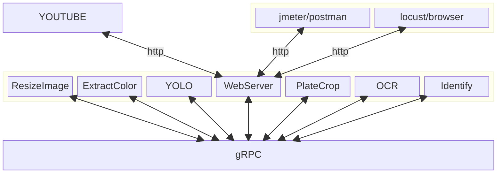
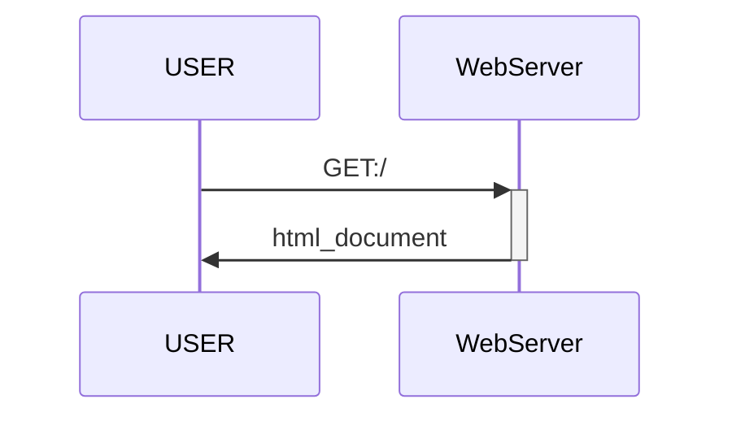
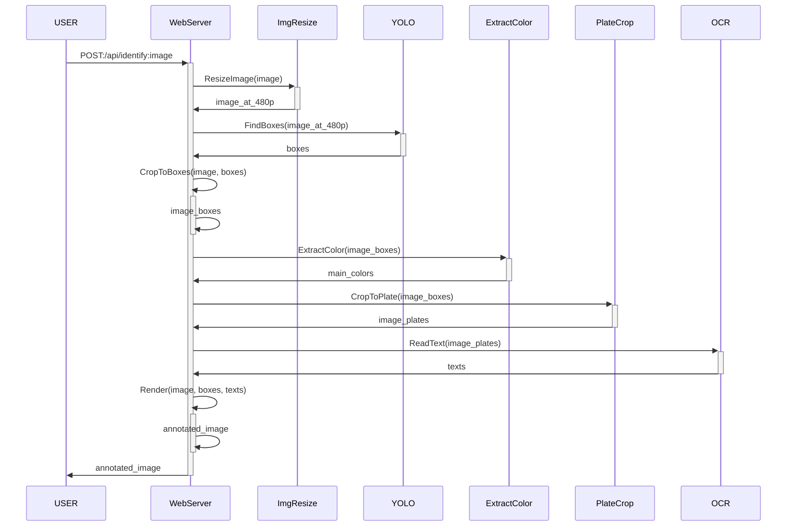
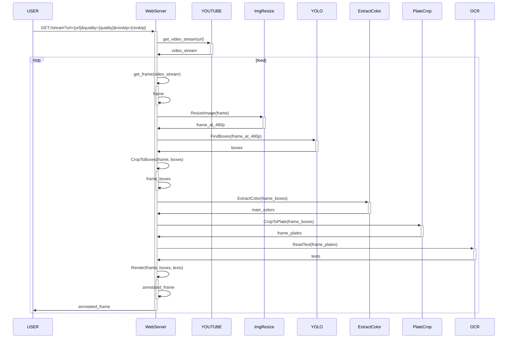

# Vehicle-Identification

This is a demo of how complex A.I. appication can be deployed as microservices on cloud environment. This project can be used as heavy and non-consistant load for load-balancing testbeds.



## Compile and start background services

### Docker

With `docker-compose`, compile and run are completed in a command.

```bash
# Build
docker-compose -f ./docker/compose.yaml build
# Run
docker-compose -f ./docker/compose.yaml up
```

### Kubernetes

First, create namespace `j12t-alpha` then execute the command:

```bash
kubectl apply -f ./k8s
```

Or just edit the `metadata.namespace` attribute in `k8s/*.yml`.

### Development environment

```bash
# work.in.progress...
sudo apt update -y && sudo apt upgrade -y
sudo apt install build-essential -y
sudo apt-get update && sudo apt-get install ffmpeg libsm6 libxext6 -y
pip install PIL vidgear easyocr numpy ultralytics matplotlib opencv --break-system-packages
```

## Run the application

### Client demo application

```bash
python Identify_Client.py
```

### Web server

By default, `WebServer` listens at port `8080`

API list:

| Endpoint                                                                       | Method | Request content-type | Response content-type                     |
|--------------------------------------------------------------------------------|--------|----------------------|-------------------------------------------|
| [/](#get-)                                                                     | GET    | None                 | text/html                                 |
| [/api/identify](#post-apiidentify)                                             | POST   | image/*              | image/png                                 |
| [/stream?url=`{{url}}`&quality=`{{quality}}`&noskip=`{{noskip}}`](#get-stream) | GET    | None                 | multipart/x-mixed-replace; boundary=frame |

## Sequence diagrams

### `GET: /`


### `POST: /api/identify`


### `GET: /stream`
